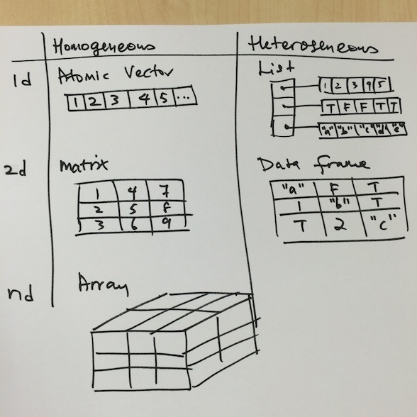

R Programming - Part 1
========================================================
author: Eugene Teo
date: January 26th, 2015

Who am i?
========================================================


[\@eugeneteo](http://www.twitter.com/eugeneteo)

Week 1
========================================================
Getting started and R nuts and bolts

Install R on a Mac
========================================================

Install R with [Homebrew](http://brew.sh/) - the missing package manager for OS X

```{shell}
$ ruby -e "$(curl -fsSL https://raw.githubusercontent.com/Homebrew/install/master/install)"
$ brew tap homebrew/science
$ brew install gcc
$ brew install Caskroom/cask/xquartz
$ brew install R
```

Then install the [RStudio Preview](http://www.rstudio.com/products/rstudio/download/preview/)

Fix the warning messages on startup
========================================================

```{shell}
$ defaults write org.R-project.R force.LANG en_US.UTF-8
$ export LC_ALL=en_US.UTF-8\nexport LANG=en_US.UTF-8 >> ~/.bash_profile
$ . ~/.bash_profile
```

Read [Installing R on Mac - Warning messages: Setting LC_CTYPE failed, using “C”](http://stackoverflow.com/questions/9689104/installing-r-on-mac-warning-messages-setting-lc-ctype-failed-using-c)

Data structures
========================================================


Data structures
========================================================


Data structures are organised by:
* their dimensionality (1d, 2d, or nd), and
* if they are homogeneous, or heterogeneous

R has no zero-dimensional, or scalar types

Individual numbers or strings are actually vectors of length one


```r
length((x <- 1))
```

```
[1] 1
```

Vectors
========================================================

There are two types of 1d vectors:
* atomic vectors (homogeneous)
* lists (heterogeneous)

Both share three common properties:
* Type, ```typeof()```, what it is
* Length, ```length()```, how many elements it contains
* Attributes, ```attributes()```, additional metadata

Atomic vectors
========================================================

There are four common types of atomic vectors:
* logical
* integer
* double
* character


```r
log_var <- c(TRUE, FALSE, T, F)
char_var <- c(letters[1:3])
int_var <- c(1L, 2L, 3L)
dbl_var <- c(1, 2.1, 3.2)
```

Atomic vectors
========================================================

Atomic vectors are always flat


```r
(x <- c(1, 2, 3, 4))
```

```
[1] 1 2 3 4
```

```r
(y <- c(1, c(2, c(3, c(4)))))
```

```
[1] 1 2 3 4
```

Coercion
========================================================

All elements in an atomic vector must be of the same type. If not, coercion will occur from the least to the most flexible types: logical, integer, double, and character


```r
(c("a", 1))
```

```
[1] "a" "1"
```

```r
typeof(c(T, 1L, 2.0))
```

```
[1] "double"
```

Lists
========================================================

1d heterogeneous vector


```r
str(x <- list(1:3, "a", c(T, F, T), c(1.2, 3.4)))
```

```
List of 4
 $ : int [1:3] 1 2 3
 $ : chr "a"
 $ : logi [1:3] TRUE FALSE TRUE
 $ : num [1:2] 1.2 3.4
```

Lists
========================================================


```r
(x <- list(1:3, "a", c(T, F, T), c(1.2, 3.4)))
```

```
[[1]]
[1] 1 2 3

[[2]]
[1] "a"

[[3]]
[1]  TRUE FALSE  TRUE

[[4]]
[1] 1.2 3.4
```

Lists
========================================================


```r
str(x <- list(a = 1:3, b= "a", c = c(T, F, T), d = c(1.2, 3.4)))
```

```
List of 4
 $ a: int [1:3] 1 2 3
 $ b: chr "a"
 $ c: logi [1:3] TRUE FALSE TRUE
 $ d: num [1:2] 1.2 3.4
```

Lists
========================================================


```r
x <- list(a = 1:3, b= "a", c = c(T, F, T), d = c(1.2, 3.4))
x[[1]]
```

```
[1] 1 2 3
```

```r
x$a
```

```
[1] 1 2 3
```

Lists
========================================================

Lists are sometimes called recursive vectors

A list can contain other lists


```r
str(x <- list(list(list(list(list())))))
```

```
List of 1
 $ :List of 1
  ..$ :List of 1
  .. ..$ :List of 1
  .. .. ..$ : list()
```

Matrices
========================================================

2d homogeneous data structure


```r
(x <- matrix(1:6, nrow = 2, ncol = 3))
```

```
     [,1] [,2] [,3]
[1,]    1    3    5
[2,]    2    4    6
```

```r
dim(x)
```

```
[1] 2 3
```

Matrices
========================================================


```r
x <- matrix(1:6, nrow = 2, ncol = 3)
# colnames(x) <- c("a", "b", "c")
# rownames(x) <- c("A", "B")
dimnames(x) <- list(c("A", "B"), # row
                    c("a", "b", "c"))
x
```

```
  a b c
A 1 3 5
B 2 4 6
```

cbind'ing and rbind'ing
========================================================


```r
x <- 1:3
y <- 10:12
cbind(x, y)
```

```
     x  y
[1,] 1 10
[2,] 2 11
[3,] 3 12
```

```r
rbind(x, y)
```

```
  [,1] [,2] [,3]
x    1    2    3
y   10   11   12
```

Factors
========================================================

Used to represent categorical variables

May be represented by numbers, but does not make sense to add, substract, average, etc


```r
(x <- factor(c("A", "B", "AB", "O")))
```

```
[1] A  B  AB O 
Levels: A AB B O
```

```r
str(x <- factor(c("A", "B", "AB", "O")))
```

```
 Factor w/ 4 levels "A","AB","B","O": 1 3 2 4
```

Factors
========================================================


```r
x <- factor(c("A", "B", "AB", "O"))
nlevels(x)
```

```
[1] 4
```

```r
attributes(x)
```

```
$levels
[1] "A"  "AB" "B"  "O" 

$class
[1] "factor"
```

Factors
========================================================


```r
x <- factor(c("A", "B", "AB", "O"))
attr(x, "levels") # levels(x)
```

```
[1] "A"  "AB" "B"  "O" 
```

```r
attr(x, "class") # class(X)
```

```
[1] "factor"
```

Missing values
========================================================


```r
x <- c(1, 2, NA, 4, 5)
is.na(x)
```

```
[1] FALSE FALSE  TRUE FALSE FALSE
```

```r
table(is.na(x))
```

```

FALSE  TRUE 
    4     1 
```

Data frames
========================================================

2d heterogeneous data structure

Can be converted into matrix using ```data.matrix()```


```r
(x <- data.frame(a = 1:3, b = c(T, F, T)))
```

```
  a     b
1 1  TRUE
2 2 FALSE
3 3  TRUE
```

```r
dim(x)
```

```
[1] 3 2
```

Data frames
========================================================

Remember that all elements in a matrix must be of the same type


```r
(x <- data.matrix(data.frame(a = 1:3, b = c(T, F, T))))
```

```
     a b
[1,] 1 1
[2,] 2 0
[3,] 3 1
```

Reading data
========================================================


```r
(x <- read.csv(text = "value\n12\n1\n.\n9"))
```

```
  value
1    12
2     1
3     .
4     9
```

```r
typeof(x$value)
```

```
[1] "integer"
```

Reading data
========================================================


```r
x <- read.csv(text = "value\n12\n1\n.\n9")
as.double(x$value)
```

```
[1] 3 2 1 4
```

```r
# ??
str(x$value)
```

```
 Factor w/ 4 levels ".","1","12","9": 3 2 1 4
```

That's not what we want...

Reading data
========================================================

Second try


```r
(x <- read.csv(text = "value\n12\n1\n.\n9", na.strings = "."))
```

```
  value
1    12
2     1
3    NA
4     9
```

```r
as.double(x$value)
```

```
[1] 12  1 NA  9
```

Reading data
========================================================

Third try


```r
str(x <- read.csv(text = "value\n12\n1\n.\n9", na.strings = ".",
               stringsAsFactors = FALSE))
```

```
'data.frame':	4 obs. of  1 variable:
 $ value: int  12 1 NA 9
```

Subsetting
========================================================


```r
x <- c(letters) # built-in constant
x[1]
```

```
[1] "a"
```

```r
x[1:5]
```

```
[1] "a" "b" "c" "d" "e"
```

```r
x[x > "s"] # return the TRUEs
```

```
[1] "t" "u" "v" "w" "x" "y" "z"
```

Subsetting vectors
========================================================


```r
x <- c(letters)
table(y <- x > "w")
```

```

FALSE  TRUE 
   23     3 
```

```r
x[y] # return the TRUEs
```

```
[1] "x" "y" "z"
```

Subsetting lists
========================================================


```r
x <- list(foo = 1:4, bar = 0.6)
x[1]
```

```
$foo
[1] 1 2 3 4
```

```r
x[[1]]
```

```
[1] 1 2 3 4
```

```r
x[["foo"]]
```

```
[1] 1 2 3 4
```

Subsetting lists
========================================================


```r
x <- list(foo = 1:4, bar = 0.6, baz = "hello")
x[c(1, 3)] # select 1st and 3rd vectors
```

```
$foo
[1] 1 2 3 4

$baz
[1] "hello"
```

Subsetting lists
========================================================


```r
x <- list(foo = 1:4, bar = 0.6, baz = "hello")
x[[c(1, 4)]]
```

```
[1] 4
```

```r
x[[c(2, 1)]]
```

```
[1] 0.6
```

```r
x[[c(3, 1)]]
```

```
[1] "hello"
```

Subsetting matrices
========================================================


```r
(x <- matrix(1:6, 2, 3))
```

```
     [,1] [,2] [,3]
[1,]    1    3    5
[2,]    2    4    6
```

```r
x[1,] # returns a vector
```

```
[1] 1 3 5
```

```r
x[,1] # returns a vector
```

```
[1] 1 2
```

Subsetting matrices
========================================================


```r
(x <- matrix(1:6, 2, 3))
```

```
     [,1] [,2] [,3]
[1,]    1    3    5
[2,]    2    4    6
```

```r
x[1, 2] # return vector of length 1
```

```
[1] 3
```

```r
x[1, 2, drop = FALSE] # return 1x1 matrix
```

```
     [,1]
[1,]    3
```

Removing NA values
========================================================


```r
x <- c(1, 2, NA, 4, NA, 5)
(bad <- is.na(x))
```

```
[1] FALSE FALSE  TRUE FALSE  TRUE FALSE
```

```r
(x[!bad])
```

```
[1] 1 2 4 5
```

```r
(x[bad])
```

```
[1] NA NA
```

Removing NA values
========================================================


```r
x <- c(1, 2, NA, 4, NA, 5)
y <- c("a", "b", NA, "d", NA, NA)
(good <- complete.cases(x, y))
```

```
[1]  TRUE  TRUE FALSE  TRUE FALSE FALSE
```

```r
(x[good]) # show all good cases
```

```
[1] 1 2 4
```

```r
(y[good][1:2]) # show 2 of 3 good cases
```

```
[1] "a" "b"
```

Removing NA values
========================================================


```r
data("airquality")
class(airquality)
```

```
[1] "data.frame"
```

```r
good <- complete.cases(airquality)
(airquality[good, ][1:6, ])
```

```
  Ozone Solar.R Wind Temp Month Day
1    41     190  7.4   67     5   1
2    36     118  8.0   72     5   2
3    12     149 12.6   74     5   3
4    18     313 11.5   62     5   4
7    23     299  8.6   65     5   7
8    19      99 13.8   59     5   8
```

Week 2
========================================================

Programming with R

Control structures - if/else
========================================================


```r
x <- 5
if (x > 3) {
   y <- 10
} else {
   y <- 0
}
y
```

```
[1] 10
```

Control structures - if/else
========================================================


```r
x <- 5
y <- if (x > 3) {
   10
} else {
   0
}
y
```

```
[1] 10
```

Control structures - if/else
========================================================


```r
x <- 5
y <- ifelse(x > 3, 10, 0)
y
```

```
[1] 10
```

Control structures - for
========================================================


```r
for (a in 1:10)
   print(a)
```

```
[1] 1
[1] 2
[1] 3
[1] 4
[1] 5
[1] 6
[1] 7
[1] 8
[1] 9
[1] 10
```

Control structures - for
========================================================


```r
(x <- c(letters[1:3])) # built-in constant
```

```
[1] "a" "b" "c"
```

```r
for (a in 1:length(x))
   print(x[a])
```

```
[1] "a"
[1] "b"
[1] "c"
```

Control structures - for
========================================================


```r
x <- c(letters[1:3])
for (a in seq_along(x)) # element indices of x
   print(x[a])
```

```
[1] "a"
[1] "b"
[1] "c"
```

```r
for (letter in x)
   print(letter)
```

```
[1] "a"
[1] "b"
[1] "c"
```

Control structures - for
========================================================


```r
(x <- matrix(1:6, nrow = 2, ncol = 3))
```

```
     [,1] [,2] [,3]
[1,]    1    3    5
[2,]    2    4    6
```

```r
for (a in 1:nrow(x))
   for (b in 1:ncol(x))
      print(x[a, b])
```

```
[1] 1
[1] 3
[1] 5
[1] 2
[1] 4
[1] 6
```

Control structures - for
========================================================


```r
x <- matrix(1:6, nrow = 2, ncol = 3)
for (a in seq_len(nrow(x))) # sh's `seq 1 n`
   for (b in seq_len(ncol(x)))
      print(x[a, b])
```

```
[1] 1
[1] 3
[1] 5
[1] 2
[1] 4
[1] 6
```

Control structures - for
========================================================


```r
x <- c(letters) # 26
for (letter in seq_along(x)) {
   if (letter == 20) break # stop at 20th
   if (letter %% 2 == 0) next # skip even
   print(x[letter])
}
```

```
[1] "a"
[1] "c"
[1] "e"
[1] "g"
[1] "i"
[1] "k"
[1] "m"
[1] "o"
[1] "q"
[1] "s"
```

seq vs seq_along
========================================================


```r
a <- c(8, 9, 10)
b <- 10

seq(a)
```

```
[1] 1 2 3
```

```r
seq_along(a) # element indices of x
```

```
[1] 1 2 3
```

seq vs seq_along
========================================================


```r
a <- c(8, 9, 10)
b <- 10

seq(b) # became seq_len? :-(
```

```
 [1]  1  2  3  4  5  6  7  8  9 10
```

```r
seq_along(b) # element indices of x
```

```
[1] 1
```

Read [seq vs seq_along. When will using seq cause unintended results?](http://stackoverflow.com/questions/13732062/seq-vs-seq-along-when-will-using-seq-cause-unintended-results)

Control structures - while
========================================================


```r
count <- 0
while (count < 10) {
   print(count)
   count <- count + 1
}
```

```
[1] 0
[1] 1
[1] 2
[1] 3
[1] 4
[1] 5
[1] 6
[1] 7
[1] 8
[1] 9
```

Control structures - while
========================================================


```r
x <- 5
while (x > 2 && x < 6 ) {
   print(x)
   coin <- rbinom(1, 1, 0.5) # n, size, prob
   if (coin == 1) { # random walk
      x <- x + 1
   } else {
      x <- x - 1
   }
}
```

```
[1] 5
[1] 4
[1] 5
```

Functions
========================================================


```r
args(lm)
```

```
function (formula, data, subset, weights, na.action, method = "qr", 
    model = TRUE, x = FALSE, y = FALSE, qr = TRUE, singular.ok = TRUE, 
    contrasts = NULL, offset, ...) 
NULL
```

Unnamed arguments are matched in order they are listed in the function definition


```r
lm(data = mydata, y ~ x, model = FALSE, 1:100)
lm(y ~ x, mydata, 1:100, model = FALSE)
```

Functions
========================================================


```r
f <- function(a, b = 1, c = 2, d = NULL) {

}
```

If no default value, you can set the argument value to NULL

Functions - lazy evaluation
========================================================

Arguments to functions are evaluated only as needed


```r
f <- function(a, b) {
   a ^ 2
}
f(10)
```

```
[1] 100
```

Functions - lazy evaluation
========================================================


```r
f <- function(a, b) {
   print(a)
   print(b)
}
f(10)
```


```
[1] 10
```


```
Error in print(b) : argument "b" is missing, with no default
```

Functions
========================================================

The ```...``` argument indicates a variable number of arguments that are usually passed on to other functions

Also necessary if the number of arguments passed to the function cannot be known in advance


```r
args(plot)
```

```
function (x, y, ...) 
NULL
```


```r
myplot <- function(x, y, type = "l", ...) {
   plot(x, y, type, ...)
}
```

Functions
========================================================

Any arguments appear after ```...``` cannot be partially matched


```r
args(paste)
```

```
function (..., sep = " ", collapse = NULL) 
NULL
```

```r
paste("a", "b", sep = ":")
```

```
[1] "a:b"
```

```r
paste("a", "b", se = ":")
```

```
[1] "a b :"
```

Dates and times
========================================================

Dates are stored internally as the # of days since 1970-01-01

Times are stored internally as the # of seconds since 1970-01-01


```r
(date <- as.Date("1970-01-01"))
```

```
[1] "1970-01-01"
```

Dates and times
========================================================

Times are represented using:
* the ```POSIXct``` class (useful if you want to store times in a data frame)
* the ```POSIXlt``` class (useful if you need information like the day of the week,
day of the year, month, day of the month)

Dates and times
========================================================


```r
(x <- Sys.Date())
```

```
[1] "2015-01-27"
```

```r
(y <- as.POSIXct(x))
```

```
[1] "2015-01-27 08:00:00 SGT"
```

```r
unclass(y)
```

```
[1] 1.422e+09
```

Dates and times
========================================================


```r
x <- Sys.Date()
(y <- as.POSIXlt(x))
```

```
[1] "2015-01-27 UTC"
```

```r
names(unclass(y))
```

```
[1] "sec"   "min"   "hour"  "mday"  "mon"   "year"  "wday"  "yday"  "isdst"
```

```r
y$mday
```

```
[1] 27
```

Dates and times
========================================================


```r
datestring <- c("January 10, 2015 10:40", "December 9, 2014 9:10")
(x <- strptime(datestring, "%B %d, %Y %H:%M"))
```

```
[1] "2015-01-10 10:40:00 SGT" "2014-12-09 09:10:00 SGT"
```

```r
class(x)
```

```
[1] "POSIXlt" "POSIXt" 
```

Read ```?strptime``` for more details

Dates and times
========================================================


```r
(x <- as.POSIXlt(as.Date("2015-01-01")))
```

```
[1] "2015-01-01 UTC"
```

```r
(y <- strptime("9 Jan 2014 11:34:21", "%d %b %Y %H:%M:%S"))
```

```
[1] "2014-01-09 11:34:21 SGT"
```

```r
x - y
```

```
Time difference of 356.9 days
```

References
========================================================

[R Programming](https://www.coursera.org/course/rprog) by Roger D. Peng, Jeff Leek and Brian Caffo

[Advanced R](http://www.amazon.com/Advanced-Chapman-Hall-Hadley-Wickham/dp/1466586966/) by Hadley Wickham

Thanks
========================================================

Join our [iDA Data Sci MOOC](https://www.facebook.com/groups/iDADataSciMOOC/) Facebook group!
